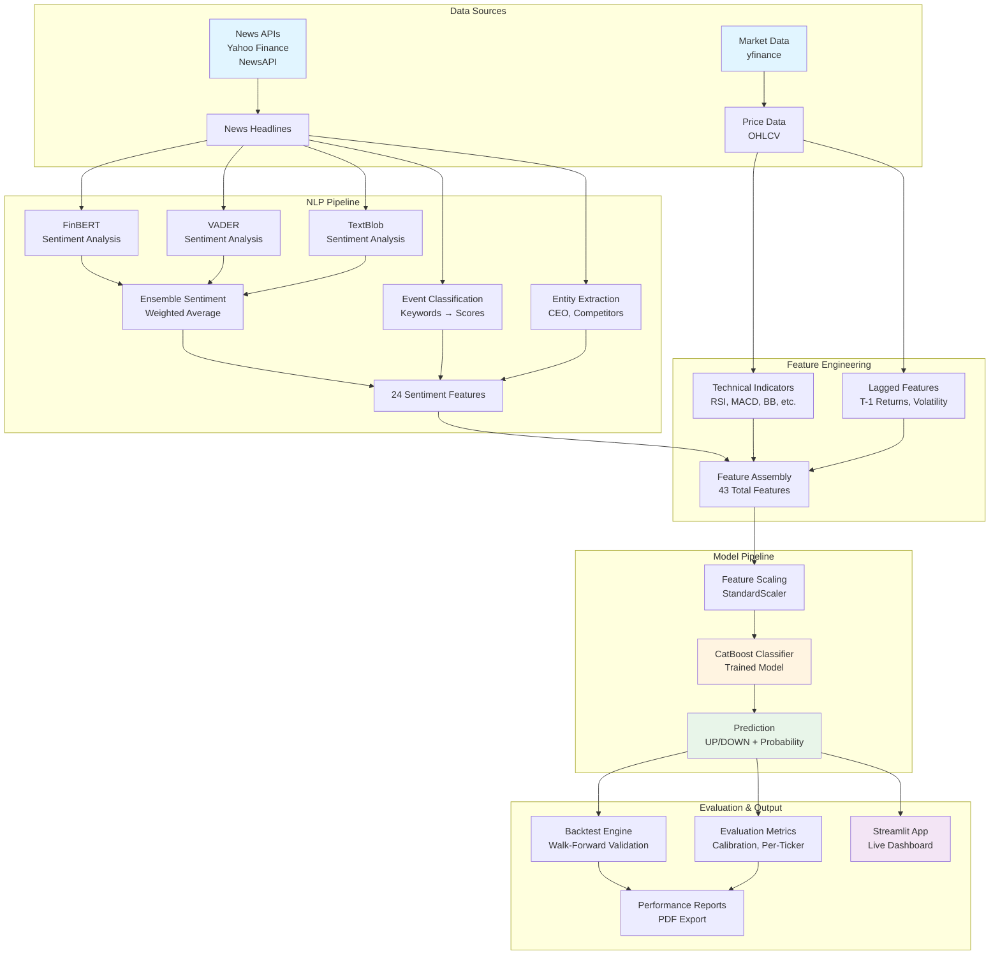

# System Architecture

## Overview

The Financial Sentiment NLP Pipeline is an end-to-end system that processes financial news, extracts sentiment features, combines them with technical indicators, and generates trading signals using machine learning.

---

## Architecture Diagram



---

## Component Details

### 1. Data Sources Layer

**News APIs**
- Yahoo Finance RSS feeds
- NewsAPI integration
- Real-time headline fetching
- Date range filtering

**Market Data**
- yfinance library
- Historical OHLCV data
- Technical indicator calculation
- Multi-ticker support

### 2. NLP Pipeline (`src/feature_engineering/nlp_pipeline.py`)

**Sentiment Models**
- **FinBERT**: Transformer-based financial sentiment (ProsusAI/finbert)
- **VADER**: Rule-based sentiment analyzer
- **TextBlob**: Polarity and subjectivity scores

**Ensemble Method**
```python
ensemble = 0.6 * finbert + 0.3 * vader + 0.1 * textblob
```

**Event Classification**
- Keyword-based classification
- Probability scores for: earnings, product, analyst, regulatory, macroeconomic, M&A
- Matches training data format

**Entity Features**
- CEO mention detection
- Competitor mentions
- Entity density
- Sentiment gaps

**Output**: 24 sentiment features

### 3. Feature Engineering (`src/feature_engineering/feature_pipeline.py`)

**Technical Indicators (15 features)**
- Momentum: RSI, Stochastic, Williams %R
- Trend: MACD, ADX, EMA
- Volatility: ATR, Bollinger Bands
- Volume: OBV, CMF, VWAP

**Lagged Features (4 features)**
- `ensemble_sentiment_mean_lag1`: Previous day sentiment
- `daily_return_lag1`: Previous day return
- `Volume_lag1`: Previous day volume
- `volatility_lag1`: Previous day volatility

**Total**: 43 features (24 sentiment + 15 technical + 4 lagged)

### 4. Model Pipeline (`src/modeling/models_backtest.py`)

**Preprocessing**
- Feature scaling (StandardScaler)
- Feature order validation
- Missing value handling

**Model**
- CatBoost Classifier
- Binary classification (UP/DOWN)
- Probability outputs
- Confidence thresholds

**Output**
- Prediction: 0 (DOWN) or 1 (UP)
- Probability: P(UP)
- Signal: BUY/SELL/HOLD
- Confidence score

### 5. Evaluation (`src/modeling/evaluation.py`)

**Metrics**
- Accuracy, Precision, Recall
- ROC-AUC, PR-AUC
- Brier Score (calibration)
- Sharpe Ratio
- Per-ticker breakdown
- Regime analysis

**Visualizations**
- Calibration plots
- Feature importance (SHAP)
- Precision-Recall curves
- Confusion matrices

### 6. Application Layer (`app/app_main.py`)

**Streamlit Dashboard**
- Real-time news fetching
- Live predictions
- Interactive charts
- PDF report generation

---

## Data Flow

### Training Pipeline

```
1. News Data → NLP Pipeline → Sentiment Features
2. Price Data → Technical Indicators
3. Historical Data → Lagged Features
4. Merge All Features → model_ready_full.csv
5. Train/Test Split (temporal)
6. Train CatBoost → catboost_best.pkl
```

### Inference Pipeline

```
1. Fetch News (last N days)
2. Generate Sentiment Features (24)
3. Fetch Technical Indicators (15)
4. Calculate Lagged Features (4)
5. Assemble → 43 Features
6. Scale Features
7. Model Prediction
8. Generate Signal (BUY/SELL/HOLD)
```

---

## Key Design Decisions

### 1. Temporal Validation
- **Walk-forward validation**: Prevents look-ahead bias
- **Strict train/test separation**: No temporal overlap
- **Gap periods**: 1-day gap between train/test

### 2. Leakage Prevention
- **Target construction**: `groupby('ticker')['Close'].shift(-1)`
- **Feature alignment**: Features at T predict movement at T+1
- **News alignment**: Weekend news → next trading day

### 3. Reproducibility
- **Random seeds**: seed=42 for all random operations
- **Feature schema**: Centralized in FEATURE_SCHEMA.py
- **Version tracking**: Model version and schema version logged

### 4. Modularity
- **Separate pipelines**: NLP, technical, lagged features
- **Lazy loading**: Models loaded on demand
- **Error handling**: Retry logic, graceful degradation

---

## Technology Stack

| Component | Technology |
|-----------|-----------|
| **NLP** | Transformers (HuggingFace), NLTK, TextBlob |
| **ML** | CatBoost, scikit-learn |
| **Data** | pandas, numpy, yfinance |
| **Visualization** | Plotly, matplotlib |
| **App** | Streamlit |
| **Testing** | pytest |

---

## File Structure

```
financial-sentiment-nlp/
├── src/
│   ├── api_clients/          # News API integrations
│   ├── feature_engineering/  # NLP + Technical features
│   ├── modeling/              # Model inference + evaluation
│   └── utils/                 # Shared utilities
├── app/                       # Streamlit application
├── scripts/                   # Data generation scripts
├── tests/                     # Test suite
├── models/                    # Trained models
├── config/                    # Configuration files
└── research_outputs/          # Results, figures, tables
```

---

## Scalability Considerations

### Current Limitations
- Single-threaded processing
- No distributed computing
- Limited caching

### Future Improvements
- Parallel processing for multiple tickers
- Redis caching for technical indicators
- Database storage for historical predictions
- API rate limiting and queuing

---

**Last Updated**: 2025-01-XX
**Version**: 1.0

