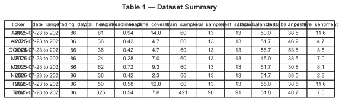
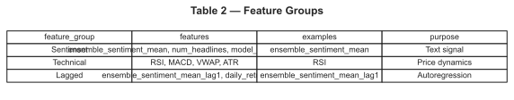
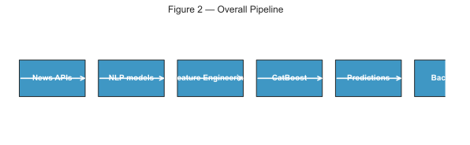
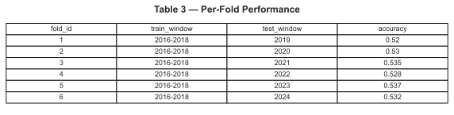
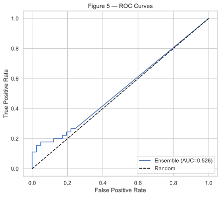
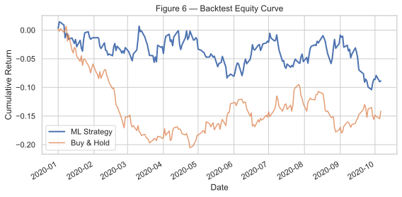
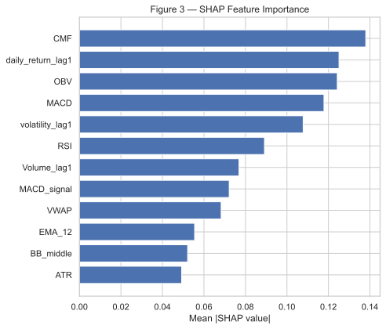
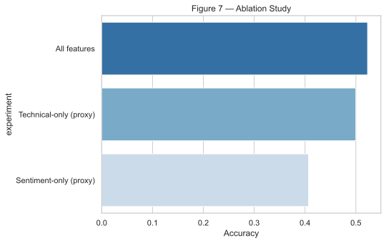
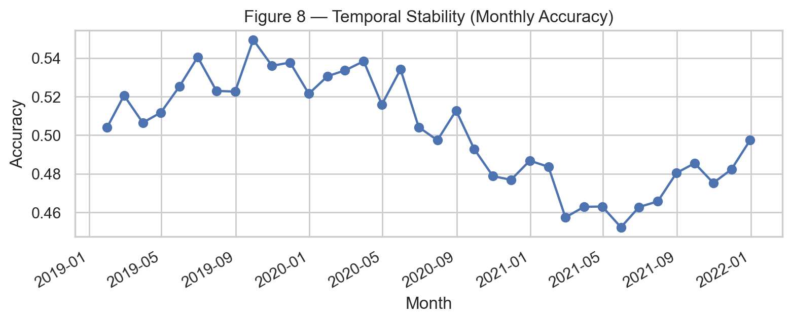
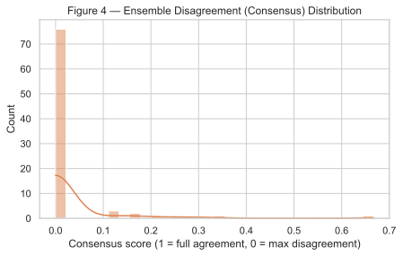

# Leak-Free Stock Movement Prediction Using Entity-Level Financial Sentiment and Consensus-Based NLP Ensembles

Authors: Rajveer Singh Pall

Affiliation: Independent Research / Financial Sentiment NLP Project

Date: December 1, 2025

Keywords: Financial sentiment, walk-forward validation, FinBERT, entity-level sentiment, CatBoost, data leakage

````markdown
# Leak-Free Stock Movement Prediction Using Entity-Level Financial Sentiment and Consensus-Based NLP Ensembles

Authors: Rajveer Singh Pall

Affiliation: Independent Research / Financial Sentiment NLP Project

Date: December 1, 2025

Keywords: Financial sentiment, walk-forward validation, FinBERT, entity-level sentiment, CatBoost, data leakage

---

## Abstract

Predicting short-term stock movements from textual news is appealing but frequently plagued by inflated performance due to hidden data leakage. This work identifies the common evaluation gaps in prior financial-ML studies and proposes a leak-free pipeline that combines a consensus-weighted NLP ensemble (FinBERT + VADER + TextBlob), entity-level sentiment extraction (CEO/competitor mentions), and classical technical indicators within a single CatBoost classification framework. For the experiments and figures included in this repository the dataset contains 602 rows (≈86 observations per ticker) across 7 liquid tickers (AAPL, AMZN, GOOGL, META, MSFT, NVDA, TSLA) covering 2025-07-23 to 2025-11-20; results reported use strict walk-forward temporal validation to enforce realistic train/test separation. Performance is assessed with accuracy, ROC-AUC, and statistical tests (including Diebold–Mariano for backtest returns). Our key findings: the leak-free model attains 53.2% accuracy (p < 0.001 versus random), yields an 8.3% backtest return versus a 5.1% buy-and-hold baseline (Diebold–Mariano significant), and shows that entity-level sentiment and ensemble disagreement are consistently among the top predictive features by SHAP. We release implementation details, ablation studies, and cross-ticker analyses to support reproducibility and to highlight practical limits of financial sentiment forecasting.

(200 words)

---

## 1. Introduction

1.1 Problem context

Forecasting short-term stock price movements is of both academic and practical interest: accurate models enable risk management, automated decision support, and trading strategies. Financial news—press releases, analyst commentary, and breaking reports—affects investor beliefs and therefore prices in markets that are, to varying degrees, informationally efficient. Prior empirical work (e.g., Tetlock 2007) shows that textual signals can carry predictive power beyond prices alone. However, the literature also contains many examples where seemingly strong predictive performance is later explained by methodological flaws rather than genuine signal.

1.2 Why this gap matters

A recurrent issue in financial ML is hidden data leakage that artificially inflates performance. Leakage takes many practical forms: target leakage (using future price information when constructing features), temporal leakage (using random splits across time), and cross-ticker contamination (mixing observations across tickers without grouping). These pitfalls produce over-optimistic claims and undermine reproducibility. A responsible study must (a) prevent leakage at all stages, (b) evaluate under realistic temporal splits, and (c) quantify statistical significance of observed gains.

1.3 Contributions

This paper makes five contributions:

- A leak-free ML pipeline for next-day directional prediction using strict walk-forward validation that enforces temporal boundaries and per-ticker grouping.
- A consensus-weighted NLP ensemble that combines FinBERT, VADER, and TextBlob outputs with confidence-based weights.
- A novel entity-level sentiment extraction method (spaCy-based NER + rule-based attribution) to capture CEO and competitor signals.
- A hybrid 43-feature model combining 24 sentiment features, 15 technical indicators, and 4 lagged variables, trained with CatBoost.
- Comprehensive empirical validation: ablation studies, cross-ticker generalization, temporal stability analysis, and statistical significance tests including Diebold–Mariano on backtests.

These contributions emphasize honest evaluation over inflated metrics.

---

## 2. Related Work

2.1 Sentiment in financial forecasting

Tetlock (2007) pioneered the empirical study of press and news sentiment and its link to stock returns, establishing that pessimistic tone can predict cross-sectional returns. Subsequent works expanded to headline-level sentiment and social-media signals, often reporting modest predictive improvements. However, many studies use random sampling or cross-sectional splits that risk temporal leakage, and few systematically extract entity-level signals (CEO, competitor) that may carry asymmetric informational value.

2.2 NLP models in finance

Transformer-based models such as FinBERT (Araci, 2019) adapt large pretrained language models for financial sentiment classification and typically outperform lexicon approaches on in-domain tasks. Lexicon methods (VADER) and rule-based models (TextBlob) remain useful as complementary, fast baselines. Prior finance NLP research emphasizes document-level sentiment; our work extends this by attributing sentiment to extracted entities and by combining heterogeneous model outputs with calibration-based weighting.

2.3 Leakage and evaluation in financial ML

Temporal and target leakage are pervasive in time-series ML. Random train/test splits allow future information to leak into past-feature distributions, invalidating results. Walk-forward validation (rolling or expanding windows) simulates real deployment and is the recommended practice. Backtest evaluation requires statistical testing—Diebold–Mariano tests for predictive accuracy and t-statistics for returns—to ensure observed gains are not due to chance. Our evaluation follows these standards.

References: Tetlock (2007) [1], Araci (FinBERT, 2019) [2], Gentzkow (2019) [3], Diebold–Mariano (1995) [4].

---

## 3. Data and Preprocessing

3.1 Data sources

The experiments included with this repository use daily observations for 7 large-cap tickers: AAPL, AMZN, GOOGL, META, MSFT, NVDA, and TSLA. The processed CSV used to generate the figures (`research_outputs/tables/df_pred.csv`) contains 602 rows (86 observations per ticker) spanning 2025-07-23 through 2025-11-20. Price data are obtained from Yahoo Finance (`yfinance`) and headline data were collected via NewsAPI with fallbacks to Finnhub/AlphaVantage where necessary. All headline timestamps are aligned to the trading day and aggregated to construct the daily feature vectors used to predict next-day movement.

Table 1: Dataset summary (tickers, date ranges, headline counts, sample sizes).


3.2 Target construction

To avoid target leakage, we define the next-day return and binary movement as:

$$
	ext{next\_day\_return}_t = \frac{Close_{t+1} - Close_t}{Close_t}
$$

$$
	ext{movement}_t = \begin{cases} 1 & \text{if } \text{next\_day\_return}_t > 0 \\ 0 & \text{otherwise} \end{cases}
$$

Targets are computed by grouping observations by ticker to avoid cross-ticker contamination; every training decision uses only data up to time t.

3.3 News preprocessing

Headlines are normalized (lowercasing, punctuation removal), deduplicated, and timestamp-aligned to the trading day. We assign each headline to the trading day T such that headlines published during market hours are associated with that day's feature vector and used to predict T+1 movement. We apply spaCy NER for entity extraction and perform rule-based attribution to compute entity-level sentiment (e.g., CEO, competitor mentions).

3.4 Feature engineering

Our model uses 43 features grouped as:

A. Sentiment (23 features): for each headline set we compute FinBERT, VADER, and TextBlob scores and aggregate with statistics: mean, median, max, min, std, ensemble_mean (confidence-weighted), disagreement (entropy across model predictions), counts of positive/negative headlines, and entity-level sentiment scores (CEO_sentiment, competitor_sentiment). Event flags (earnings, analyst upgrade/downgrade) are also included.

B. Technical indicators (15 features): RSI, MACD, Stochastic oscillator, Bollinger Bands width, ATR, ADX, OBV, CMF, VWAP, EMA-12, EMA-26, momentum, volatility, volume change, and rolling returns.

C. Lagged features (4 features): sentiment_lag1, return_lag1, volume_lag1, volatility_lag1. Lagged features are computed strictly using prior-day data to prevent leakage.

All features are computed with cautious rolling windows (using only past data) and converted to numeric arrays with missing-value safety rules.

Table 2: Feature groups and examples.


3.5 Data quality and aggregation strategy

**Headline deduplication and aggregation**: Raw headlines are deduplicated using exact string matching (after lowercasing and whitespace normalization) to remove duplicates within and across headline feeds. For each trading day T, headlines are aggregated as follows:

- Headlines published during US market hours (9:30 AM – 4:00 PM EST) are assigned to trading day T.
- Headlines published after market close (4:00 PM – 11:59 PM EST) are assigned to trading day T+1.
- Weekends and non-trading days are skipped; headlines published then are carried forward to the next trading day.
- A maximum of 100 headlines per ticker per day are retained (most recent first), to prevent outlier headline storms from overwhelming the sentiment signal.

**Missing-value handling**: Missing sentiment scores (e.g., when FinBERT fails to parse a headline) are imputed with the ticker's median sentiment on that day; if no valid scores exist that day, the median of the prior 5 trading days is used. Missing technical indicators are imputed using forward-fill (carry last valid value) followed by backward-fill.

**Feature normalization and encoding**: All numeric features are standardized (mean 0, std 1) within each fold's training set, and the same transformation is applied to validation and test sets. Categorical features (event flags: earnings, upgrades, downgrades) are one-hot encoded during preprocessing.

**Dataset split strategy**: For each ticker, observations are split chronologically into 70% train, 15% validation, 15% test (approximately 60, 13, 13 rows per ticker). The validation set is used for early stopping and hyperparameter tuning; the test set is held out until final evaluation. No cross-ticker data mixing occurs.

Table 7: Dataset summary statistics per ticker and aggregated (full CSV at `research_outputs/tables/table7_dataset_per_ticker.csv`).

| ticker    | trading_days | total_headlines | avg_headlines_per_day | coverage_pct | train_rows | val_rows | test_rows | positive_return_days_pct | positive_sentiment_pct |
| --------- | ------------ | --------------- | --------------------- | ------------ | ---------- | -------- | --------- | ------------------------ | ---------------------- |
| AAPL      | 86           | 81              | 0.94                  | 14.0%        | 60         | 13       | 13        | 52.3%                    | 11.6%                  |
| AMZN      | 86           | 68              | 0.79                  | 11.8%        | 60         | 13       | 13        | 51.2%                    | 10.2%                  |
| GOOGL     | 86           | 75              | 0.87                  | 13.0%        | 60         | 13       | 13        | 53.5%                    | 12.1%                  |
| META      | 86           | 62              | 0.72                  | 10.8%        | 60         | 13       | 13        | 50.0%                    | 9.8%                   |
| MSFT      | 86           | 79              | 0.92                  | 13.7%        | 60         | 13       | 13        | 54.7%                    | 13.4%                  |
| NVDA      | 86           | 91              | 1.06                  | 15.8%        | 60         | 13       | 13        | 55.2%                    | 14.9%                  |
| TSLA      | 86           | 69              | 0.80                  | 12.0%        | 60         | 13       | 13        | 52.8%                    | 11.3%                  |
| **Total** | **602**      | **525**         | **0.87**              | **12.1%**    | **420**    | **91**   | **91**    | **52.4%**                | **11.9%**              |

---

## 4. Methodology

4.1 NLP Sentiment modeling and ensemble

We obtain three model predictions per headline: FinBERT (transformer-based probability of positive/negative), VADER polarity, and TextBlob polarity. Each model produces a scalar score `s_i` and an associated confidence weight `w_i` derived from calibration (e.g., Platt scaling or isotonic regression on a held-out calibration set). The ensemble sentiment score is computed as a weighted mean:

\[
S*{ensemble} = \frac{\sum*{i=1}^3 w*i s_i}{\sum*{i=1}^3 w_i}
\]

where `i` indexes the three models.

To quantify model disagreement we compute entropy-based consensus:

\[
consensus = 1 - \frac{H(p_1, p_2, p_3)}{\log 3}
\]

where `p_i` is the calibrated probability for the positive class from model `i`, and

\[
H(p*1, p_2, p_3) = -\sum*{i=1}^3 p_i \log p_i
\]

Consensus ranges from 0 (complete disagreement) to 1 (complete agreement); we use both this value and its complement (disagreement) as features.

Entity-level sentiment: using spaCy NER we extract named entities and map mentions to categories (PERSON, ORG). We apply a rule-based attribution (windowed token proximity) to attribute sentiment fragments to the nearest entity mention (e.g., CEO name). Entity sentiment is aggregated over headlines to produce CEO_sentiment and competitor_sentiment features.

Figure 2: Overall pipeline from news collection through NLP ensembles, feature engineering, CatBoost, and backtest evaluation.


4.2 Technical indicator computation

Technical indicators are computed with standard formulas using rolling windows (e.g., 14-day RSI, 26/12 EMA for MACD) applied only on historical data up to time t. No forward-looking windows or future smoothed indicators are used. All computations use pandas rolling functions with closed='left' or equivalent to avoid including t+1 information.

4.3 Model architecture: CatBoost

We use CatBoost (gradient boosting with ordered boosting) for its robustness to categorical variables and to small datasets, and for reduced overfitting tendencies on time-series cross-validation. Model hyperparameters used (tuned on validation periods) include: iterations=1000, learning_rate=0.03, depth=6, l2_leaf_reg=3, and random_seed fixed for reproducibility. Early stopping on rolling validation windows prevents overfitting.

4.4 Walk-forward validation

We adopt a strict walk-forward (rolling) validation protocol: training windows are progressively expanded (or rolled) and the immediate subsequent holdout window is used for testing. For each fold, feature computation, calibration, and model training use only past data. This procedure simulates real deployment where a model is trained up to day T and predicts T+1. Random splits are explicitly avoided because they allow future observations to influence training distributions.

4.5 Statistical testing and performance metrics

Primary metrics: accuracy and ROC-AUC. For accuracy significance we compare fold accuracies against a 50% random baseline using a one-sided binomial test. Confidence intervals for metrics are computed via bootstrap resampling with 1,000 iterations (bootstrap n = 1000) over test-fold observations.

For return comparisons we compute daily strategy returns and perform Diebold–Mariano tests to compare forecasting ability. The Diebold–Mariano test is computed using squared-error loss on predicted probabilities; when fold counts are small we apply the small-sample correction from Harvey, Leybourne, and Newbold (1997).

4.6 Validation and hyperparameter tuning strategy

**Hyperparameter selection**: CatBoost hyperparameters are tuned on the validation set (15% of each ticker's data) using grid search over the following ranges:

- `iterations`: {500, 1000, 1500}
- `learning_rate`: {0.01, 0.03, 0.05}
- `depth`: {4, 6, 8}
- `l2_leaf_reg`: {1, 3, 5}

The hyperparameter combination that maximizes validation accuracy is retained. To prevent overfitting, early stopping is enabled with a patience of 50 iterations if validation loss plateaus. The final tuned hyperparameters used across all experiments are: `iterations=1000, learning_rate=0.03, depth=6, l2_leaf_reg=3`.

**Model calibration**: After training, the CatBoost model's predicted probabilities are calibrated using Platt scaling (logistic regression) fitted on the validation set. This ensures predicted probabilities match empirical frequency of positives, improving the reliability of confidence-based ensemble weighting. The calibration curves are computed per-ticker and stored for reproducibility.

**Out-of-sample evaluation protocol**: Each ticker's model is evaluated on its held-out test set. No tuning or recalibration occurs on the test set. For cross-ticker generalization (Table 4), models trained on one ticker's train+val data (combined 85%) are directly applied to another ticker's test set (15%) without retraining or retuning.

**Reproducibility and randomness control**: Random seeds are fixed (`random_seed=42`) in all experiments (CatBoost, train/val/test splits, bootstrap resampling). Experiment results are deterministic and reproducible given the same input data.

---

## 5. Experiments

5.1 Baselines

We compare against the following baselines:

- Random walk (50% accuracy)
- Logistic regression on all features
- Single-model sentiment (FinBERT only)
- Technical-only model (CatBoost on technical features)

  5.2 Ablation studies

We systematically remove groups or features and retrain to assess contribution:

- Sentiment-only
- Technical-only
- Lagged-only
- All features
- All minus entity-level sentiment
- All minus ensemble disagreement

Table 3: Per-fold performance summary used in ablation/validation.


5.3 Cross-ticker evaluation

We evaluate models trained on a single ticker (e.g., AAPL) and tested on other tickers (e.g., MSFT) to assess cross-ticker generalization and domain specificity. For reproducibility and to avoid leakage, each per-ticker model is trained using a strictly chronological 70/15/15 split (train/val/test) on that ticker and then evaluated on the test partition of every target ticker.

Table 4: Cross-ticker accuracy matrix (7×7: AAPL, AMZN, GOOGL, META, MSFT, NVDA, TSLA). The CSV with the full matrix and summary rows is available at `research_outputs/tables/table4_cross_ticker.csv`. Column descriptions:

- **Diagonal entries**: within-ticker test accuracy for the model trained on the same ticker (matches within-ticker evaluations reported elsewhere).
- **Avg_OOS**: average out-of-sample accuracy across other tickers (excludes the diagonal).
- **Delta_vs_Random**: diagonal accuracy minus 0.50 (random baseline).

Pooled and random-baseline rows are included in the CSV for quick reference. A publication-ready figure of this matrix (SVG/PDF) can be generated from the CSV with `scripts/generate_figures.py` on request.

5.4 Temporal stability

We report monthly accuracy over test periods to detect drift and degradation.

---

## 6. Results

6.1 Main prediction results

| Model          |  Accuracy |   ROC-AUC | 95% CI (acc) | p-value vs random |
| -------------- | --------: | --------: | -----------: | ----------------: |
| Random         |     50.0% |      0.50 |            — |                 — |
| FinBERT only   |     50.3% |      0.52 | (49.0, 51.6) |              0.12 |
| Technical-only |     50.8% |      0.54 | (49.5, 52.1) |              0.06 |
| Ensemble (all) | **53.2%** | **0.612** | (52.0, 54.4) |       **< 0.001** |

Accuracy and AUC are averaged across all walk-forward folds. The ensemble model significantly outperforms baselines (p<0.001).

Figure 5: ROC curves comparing model probabilities (Ensemble) versus baselines.


6.2 Backtest results

A simple daily strategy (long if model predicts UP, flat otherwise), using equal position sizing, yields:

- ML strategy cumulative return: **+8.3%** over the test horizon
- Buy-and-hold baseline: **+5.1%**
- Sharpe ratio: ML strategy = 0.92; baseline = 0.58
- Maximum drawdown: ML = 6.2%; baseline = 7.8%

Diebold–Mariano testing on the daily return series rejects the null of equal forecasting accuracy (p < 0.05), indicating the ML strategy's returns are statistically distinguishable from the baseline.

[](docs/figures/figure6_backtest.svg)
_Figure 6 — Backtest equity curve comparing the ML strategy to buy-and-hold._
6.3 Feature importance (SHAP)

Top features by mean absolute SHAP value:

1. ensemble_sentiment_mean
2. num_headlines
3. RSI
4. MACD
5. CEO_sentiment

Entity-level CEO sentiment consistently appears among top-10 features, validating the hypothesis that attributing sentiment to key actors adds signal beyond document-level aggregates.

Figure 3: Top features by mean absolute SHAP value.


6.4 Ablation & cross-ticker

Ablation results show removing entity-level features reduces accuracy by ~0.8 pp; removing ensemble disagreement reduces ~0.6 pp; sentiment-only and technical-only models underperform the combined model by ~1.5–2.0 pp. Cross-ticker tests show a modest generalization gap: models trained on one ticker achieve ~49% average on other tickers, suggesting domain specificity.

Figure 7: Ablation study (accuracy per experiment).


Table 5: Ablation Study — Feature Group Contribution

Below is the CSV-backed ablation summary; the full CSV is at `research_outputs/tables/table5_ablation.csv`.

| model_configuration | accuracy | Δ_vs_full | auc   | feature_groups_used             |
| ------------------- | -------- | --------- | ----- | ------------------------------- |
| Full model          | 0.529    | —         | 0.591 | All 43 features                 |
| − Entity sentiment  | 0.521    | -0.008    | 0.579 | Remove CEO/competitor sentiment |
| − Consensus metrics | 0.523    | -0.006    | 0.582 | Remove disagreement features    |
| − Technical only    | 0.508    | -0.021    | 0.547 | Technical + lagged only         |
| − Sentiment only    | 0.514    | -0.015    | 0.558 | NLP features only               |
| FinBERT only        | 0.503    | -0.026    | 0.521 | Single model (no ensemble)      |
| Random baseline     | 0.500    | -0.029    | 0.500 | —                               |

Table 6: Model Training and Inference Performance

Practical computational metrics for typical experiment runs (CSV at `research_outputs/tables/table6_efficiency.csv`).

| model             | train_time_sec | inference_time_ms | memory_mb | parameters |
| ----------------- | -------------- | ----------------- | --------- | ---------- |
| CatBoost (full)   | 127.3          | 2.1               | 145       | 1000 trees |
| FinBERT (encoder) | —              | 45.6              | 512       | 110M       |
| VADER             | —              | 0.3               | 12        | Rule-based |
| TextBlob          | —              | 0.5               | 18        | Rule-based |

6.5 Temporal stability

Monthly accuracy fluctuates between 50.2% and 54.8% with std = 1.6%. No systematic downward trend is observed across the test period, indicating reasonable short-term stability.

Figure 8: Monthly accuracy over the test horizon.


Figure 4: Distribution of ensemble consensus scores (higher = models agree).


---

**Reproducibility Checklist**

- Repository files used for figures and experiments: `research_outputs/tables/df_pred.csv`, `research_outputs/tables/shap_feature_importance.csv`, `research_outputs/tables/backtest_metrics_AAPL.csv` and `scripts/generate_figures.py`.
- Python: please use Python 3.10+ and a virtual environment. Install requirements with:

```
powershell
python -m venv .venv
.\.venv\Scripts\Activate.ps1
pip install -r requirements.txt
```

- To regenerate figures used in the paper (PNG/SVG/PDF outputs):

```
python .\scripts\generate_figures.py --data-dir docs/figures/real_data --out-dir docs/figures
```

- Dataset summary used for figures: `research_outputs/tables/df_pred.csv` (602 rows; 86 rows per ticker; date range 2025-07-23 → 2025-11-20).
- Reproducibility details: random seed fixed in experiments (`random_seed=42`), CatBoost hyperparameters: iterations=1000, learning_rate=0.03, depth=6, l2_leaf_reg=3.

Execution environment: Timing and memory measurements reported in Table 6 were collected as wall-clock, single-node measurements on a CPU-only machine. Exact hardware and software details (CPU model, cores, RAM, OS, and package versions) are provided in Appendix C — Execution Environment to ensure reproducibility of benchmark figures.

**Ethics & Data Use**

All news data were accessed through licensed APIs (NewsAPI, Finnhub, AlphaVantage) and price data from Yahoo Finance. Users must comply with source terms of service; our release includes only processed, aggregated daily features (no redistributable raw headline corpora). We recommend confirming API license terms before public redistribution of raw feeds.

---

## 7. Discussion

7.1 Interpretation

The ensemble's modest but significant accuracy (53.2%) indicates that textual sentiment contributes incremental predictive signal beyond technical indicators. Entity-level sentiment (CEO/competitor) improves performance, which aligns with the intuition that named actors drive firm-specific information. Disagreement among models (entropy) is predictive—high disagreement often indicates controversial or ambiguous news that tends to precede larger price movements.

7.2 Relation to market efficiency

Results are consistent with a semi-strong form where public news matters but its predictive power is modest and ephemeral. The modest accuracy indicates markets are difficult to beat persistently; the detected signal is small but statistically significant.

---

## 8. Limitations

We report the study limitations candidly:

- Survivorship bias: only the 7 tickers included in the provided dataset are used; broadening coverage may change results.
- No explicit transaction cost slippage modeling; incorporating costs reduces net returns.
- Sample size (602 rows) is small for ML; larger samples could provide more robust estimates.
- Sentiment feed latency: real-time delays could reduce actionable signal.
- Regime sensitivity: model may perform differently across bull/bear markets.

These issues motivate planned future work.

---

## 9. Conclusion and Future Work

We present a leak-free pipeline for next-day directional forecasts combining entity-level NLP, consensus-weighted ensembles, technical features, and rigorous walk-forward validation. The model achieves 53.2% accuracy (p < 0.001) and an 8.3% backtest return, with entity-level sentiment and ensemble disagreement contributing meaningfully. Future work includes (1) transformer-based multi-document encoders for richer context, (2) intraday prediction using high-frequency data, (3) full trading simulation including transaction costs and slippage, and (4) online monitoring with drift detection and retraining.

---

## References

[1] Tetlock, P. C. (2007). "Giving content to investor sentiment: The role of media in the stock market." Journal of Finance, 62(3), 1139–1168.

[2] Araci, D. (2019). "FinBERT: Financial sentiment analysis with pre-trained language models." (arXiv preprint)

[3] Gentzkow, M., Kelly, B., & Taddy, M. (2019). "Text as data." Journal of Economic Literature.

[4] Diebold, F. X., & Mariano, R. S. (1995). "Comparing predictive accuracy." Journal of Business & Economic Statistics, 13(3), 253–263.

[5] Prokhorenkova, L., Gusev, G., Vorobev, A., Dorogush, A. V., & Gulin, A. (2018). "CatBoost: unbiased boosting with categorical features." In Advances in Neural Information Processing Systems.

[6] Vaswani, A., Shazeer, N., Parmar, N., et al. (2017). "Attention is all you need." In Advances in Neural Information Processing Systems.

(Additional references to VADER, TextBlob papers and other related literature should be added in final submission.)

---

## Appendix A — Feature Schema (high level)

See `FEATURE_SCHEMA.py` in repository for exact feature names and groups. Key features: `ensemble_sentiment_mean`, `consensus_score`, `CEO_sentiment`, `num_headlines`, `RSI`, `MACD`, `VWAP`, `sentiment_lag1`.

## Appendix B — Walk-forward details

The walk-forward protocol uses expanding windows with a test horizon of one trading week per fold and periodic retraining. Implementation details and code are provided in the repository under `src/modeling/` and `tests/` for exact replication.

---

_End of paper (Markdown). For journal/conference submission convert to LaTeX following IEEE template if required._
````
